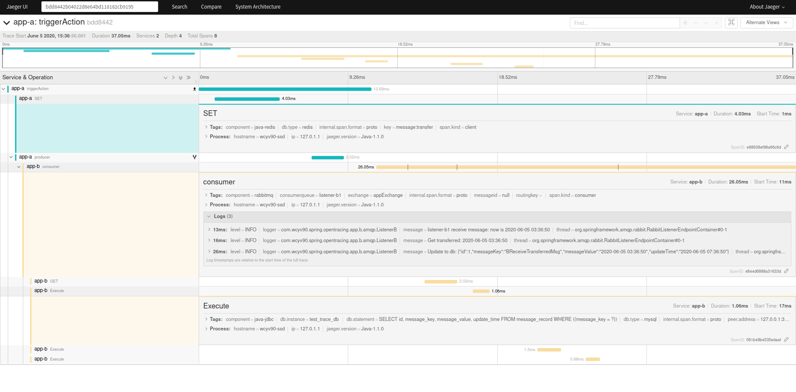
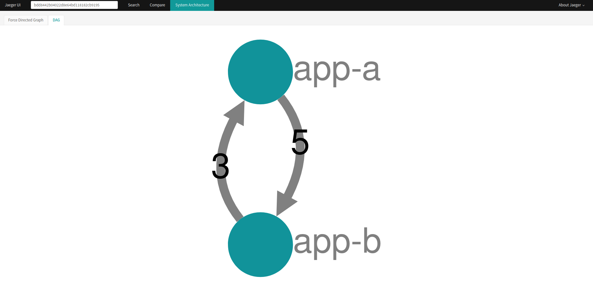

# spring-opentracing
spring boot/cloud with opentracing(jaeger), instead of sleuth

# x-tracing-starter
### 引入jaeger-cloud，以及自定义扩展
* 环境变量:opentracing.jaeger.sleuth-like-log=false，关闭sleuth-like日志格式 
example : 2020-06-04 10:09:00.004  INFO [app-b,a57d1ed6a1c6962f871c6d5f73b10779,335d0d2ff23f1867,d7d83193423f9ff1]
* 增加配置项：zipkin-shared
* 增加配置项：log-span-detail，自定义reporter，打印span详情

### mybatis-generator 的 gradle task
相关配置文件:
- script/mybatis-generator.properties
- script/generatorConfig-DynamicSql.xml
- mybatis-generator.gradle
执行:gradle mybatisGenerator 生成

### 两个服务app-a和app-b，展示feign、rabbitmq、redis、jdbc系统调用图
* a --feign--> b
* a.schedule-> a set redis -> a send mq -> b receive -> b read redis -> b write mysql

### jaeger ui

